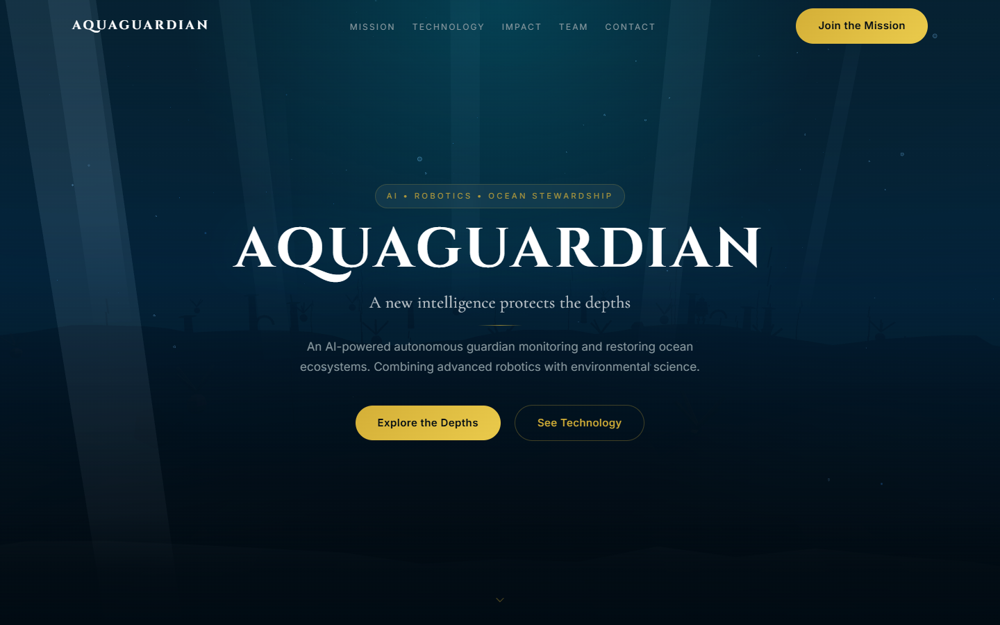
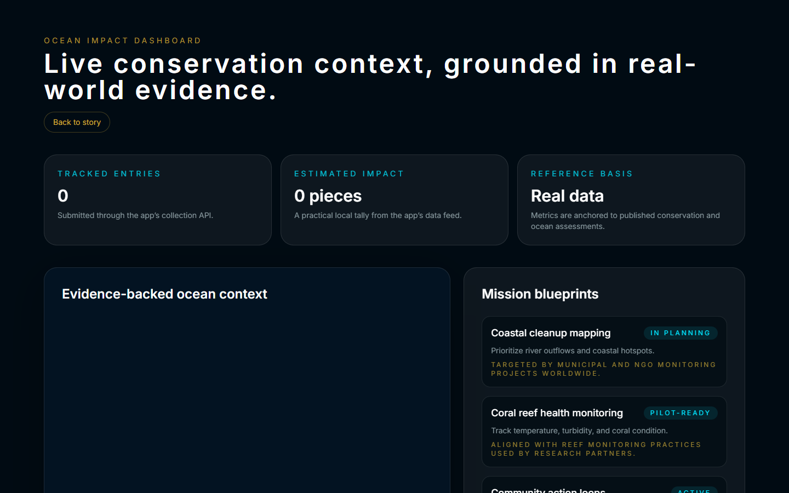
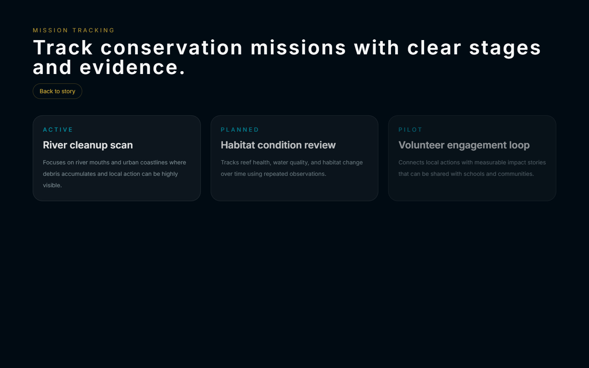
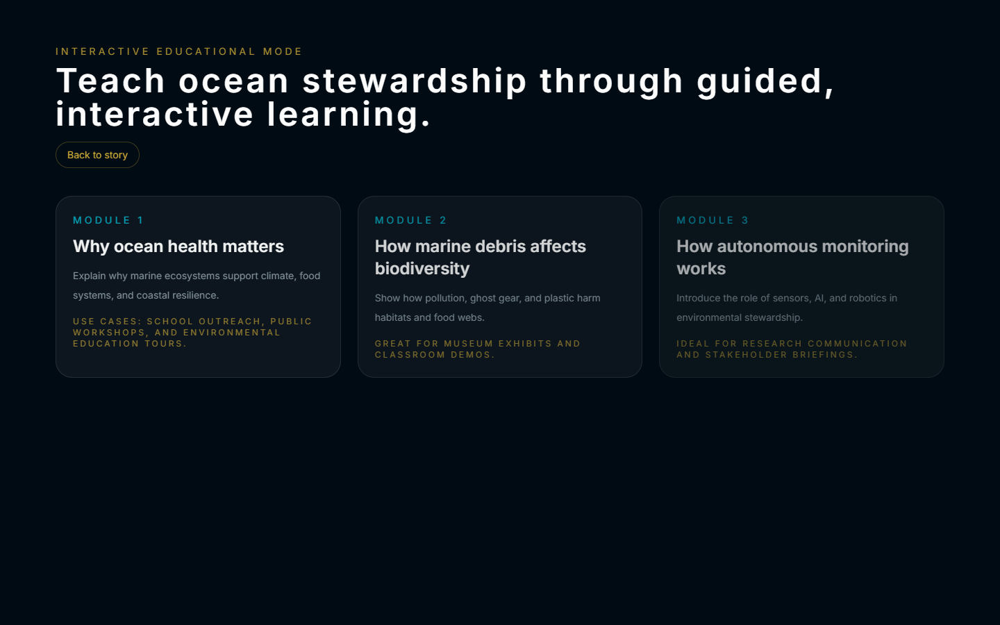

# 🌊 AquaGuardian — AI-Powered Ocean Restoration & Storytelling

> **Yo, hey!** This is AquaGuardian — a cinematic underwater experience where deep-sea mystery meets some seriously overengineered web tech. Dive into a living 3D ocean, watch an AI guardian do its thing, and get the real data behind ocean restoration. It's a premium experience, not a brochure. Trust me, I was *this close* to just making another landing page. (I didn't.)

[](https://hustlenix.github.io/aquaguardian/)
[](https://nextjs.org/)
[](https://react.dev/)
[](https://www.typescriptlang.org/)
[](https://threejs.org/)
[](https://tailwindcss.com/)
[](https://gsap.com/)
[](https://zustand.docs.pmnd.rs/)

---

## 🖼️ Screenshots

*(It looks way cooler when you actually scroll it, but here's the proof)*

| Cinematic hero | Impact dashboard |
|---|---|
|  |  |

| Mission tracking | Educational mode |
|---|---|
|  |  |

---

## 🐚 What Is AquaGuardian?

Okay, real talk: this is an interactive, story-driven experience built around a fictional-but-grounded vision of autonomous ocean restoration. It's *not* a landing page — I repeat, NOT a landing page. As you scroll, a real-time 3D underwater world comes alive: light shafts bend, fish scatter like they've seen me approach (they're just like that), the AquaGuardian robot scans the seabed, and an AI command story unfolds chapter by chapter. Lowkey feels like a movie you get to control.

Here's what's packed in:

- **A real-time 3D ocean environment** — custom GLSL shaders for water caustics, volumetric light rays, and bioluminescent atmosphere, rendered with Three.js + React Three Fiber. I wrote actual shaders for this. That's basically magic with math.
- **Scroll-driven cinematic narrative** — an 11-chapter story arc from surface descent to ocean restoration, choreographed with GSAP and Framer Motion. It's the kind of scroll experience that makes you go "whoa" and then screenshot it to send your friends.
- **A digital command center** — full product-style routes: live dashboard, mission tracking, community challenges, educational content, an AI assistant, and a mobile companion view. It's a whole ecosystem, fr.
- **Performance-aware rendering** — adaptive DPR, device-tier detection, and reduced-motion support so the experience stays smooth everywhere. Even on that one laptop with 3 tabs of Chrome open. You know the one.

---

## 🧭 The Narrative Arc

The homepage tells an 11-chapter story (mapped in `src/data/chapters.ts`): **Arrival** at the ocean's edge, **Descent** through the fading light, the **Crisis** of pollution and reef decay, the **Discovery** of ancient ruins, the **Robot Reveal** (this is the good part), **AI Command** telemetry, the **Mission**, **Technology Stations**, **Impact Metrics**, the vision of a restored **Future Atlantis**, and the final **Call to Action**. It's basically an underwater hero's journey, and you're the protagonist. No pressure.

---

## ✨ Key Features & Routes

| Route | Purpose |
|---|---|
| `/` | Cinematic 3D hero + scroll-driven narrative sections (Mission, Technology, Impact, Team, Contact) |
| `/dashboard` | Impact dashboard with live-style telemetry and ocean-health metrics |
| `/missions` | Conservation mission tracker |
| `/challenges` | Community challenge mode |
| `/learn` | Educational content about marine ecosystems and restoration science |
| `/assistant` | AI assistant layer explaining the world, robotics, and mission context |
| `/mobile` | Mobile-first companion experience for field teams |
| `/privacy` | Privacy policy (I won't sell your data, promise) |

---

## 🛠️ Tech Stack

| Layer | Tools |
|---|---|
| Framework | Next.js 15 (App Router, static export), React 19, TypeScript |
| Styling | Tailwind CSS 4 with a strict design-token system (`src/tokens/`) |
| 3D | Three.js, React Three Fiber, custom GLSL shaders (`src/shaders/`) |
| Motion | GSAP, Framer Motion, Lenis smooth scroll |
| State | Zustand (`src/store/`) |
| Quality | ESLint + Prettier, typed components, reduced-motion hooks |

**Engineering highlights** *(okay let me flex for a sec)*

- **Custom shaders over heavy geometry** — volumetric light rays and water caustics are computed procedurally on the GPU instead of rendering expensive spotlights and geometry. Translation: it looks expensive but it's secretly efficient. Like me in school.
- **Modular scene isolation** — individual meshes (kelp, fish, particles) subscribe only to the Zustand slices they need, avoiding full-canvas re-renders. Each fish minding its own business. Respect.
- **Unidirectional narrative state** — scroll position drives discrete environmental properties (debris count, lighting, robot scan-beams) through a single store. One source of truth, zero drama.
- **Accessibility first** — `prefers-reduced-motion` is respected by JS motion and CSS animation alike; high-contrast foreground values throughout. Because cool animations shouldn't come at the cost of making the internet unusable for people. Great power, great responsibility, all that.

---

## 📁 Project Structure

```text
AquaGuardian_FullStack/
├── .github/workflows/      # GitHub Pages CI/CD
├── assets/                 # Models, textures, HDRs, audio, screenshots
├── public/                 # Favicon set, manifest, OG image, robots, sitemap
├── scripts/                # Asset-generation helpers
├── src/
│   ├── app/                # App Router pages, layouts, metadata, loading/template
│   ├── components/
│   │   ├── animations/     # Text reveals, stagger, counter animations
│   │   ├── sections/       # Hero, Mission, Impact, Technology, Timeline, FAQ…
│   │   └── ui/             # Navigation, buttons, glass panels, dashboard widgets
│   ├── data/               # Chapters, impact data, scene states
│   ├── hooks/              # useReducedMotion, useDeviceTier, useSceneManager
│   ├── lib/                # GSAP/Lenis configuration, constants
│   ├── shaders/            # GLSL fragment & vertex shaders
│   ├── store/              # Zustand global state
│   ├── tokens/             # Colors, motion, spacing, typography, elevation
│   └── world/              # R3F canvas: World, Lighting, Seabed, Robot, Fish…
├── package.json
└── next.config.ts          # Static export + basePath handling
```

---

## 🚀 Getting Started

### Prerequisites

- Node.js 18 or newer
- npm (or pnpm, or bun, I don't judge)

### Install & develop

```bash
npm install
npm run dev        # http://localhost:3000
```

Boom. It's running. You're welcome.

### Build & lint

```bash
npm run build      # production build
npm run lint       # ESLint — we keep this at zero problems, fr
npm run format     # Prettier
```

### Static export (GitHub Pages)

The project is configured for fully static hosting (no server needed — it's a ghost ship in the best way):

```bash
STATIC_EXPORT=true npm run build
```

The export lands in `out/`. The GitHub Actions workflow (`.github/workflows/gh-pages.yml`) runs exactly this, then deploys to **https://hustlenix.github.io/aquaguardian/**. Push to `main`, grab a snack, come back to a live deploy. It's like magic, but with YAML.

### Scripts (Python build tooling)

Yes, we speak other languages here too — Python does the boring-but-important build-time work so the site never lies to you:

```bash
python scripts/screenshot_check.py    # fail if a screenshot rotted into a blank image
python scripts/validate_assets.py     # fail if any referenced asset went missing
python scripts/analyze_ocean_data.py  # database.json -> src/data/ocean_analysis.json
python scripts/generate_social_banner.py  # renders public/social-banner.svg
```

Zero npm dependencies. Just Python 3 and your sense of wonder.

---

## ♿ Accessibility

Motion is a core part of the experience — but so is respecting the user. `useReducedMotion` detects `prefers-reduced-motion` and scales back camera movement, reveals, and the loader; a global CSS guard collapses CSS animations as well. Keyboard navigation is supported with high-visibility cyan focus rings, and text meets high-contrast thresholds against the abyssal palette. Because an ocean experience shouldn't be a barrier to anyone. (Also because Aunt May would be proud.)

---

## 📜 Credits & Notes

- Built as a polished showcase of interactive web experience design, 3D storytelling, and frontend engineering. Lots of late nights, one existential crisis about fish AI, worth it.
- AI tools were used to accelerate prototyping, UI iteration, and implementation support; final product direction and technical decisions were reviewed and refined by the human author. So yeah, some of us are robots too. Very on-theme.
- Ocean conservation content is framed as an informed, evidence-aware vision — no fabricated metrics. The ocean deserves better than made-up numbers.

> *"The sea, once it casts its spell, holds one in its net of wonder forever."* — Jacques Yves Cousteau

Developed with 💙 by the AquaGuardian team. The ocean's counting on us — no pressure, but also, all the pressure.
